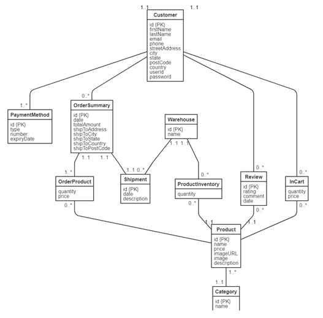

# COSC 304 Group 43
## Mission Statement
You remember the good old days when you and your friend gathered change to go down to the Arcade to play your favourite games like Pac-Man, Donkey Kong and Street Fighter. Now you can go back to the good old days and hit nostalgia head-on with the wide range of collector items we provide. Some of these collector's items include wearables, figurines, books, posters, limited-edition collectibles, you name it, we've got your back.
## Executive Summary
Shop_Name is an e-commerce site that allows collectors access to a wide range of video game collectibles. Here at Shop_Name, we specialize in video game-related merchandise, allowing devoted collectors to seek out the favourite items they have desired and add them to their valuable collections. There are numerous options, such as Guides which were extremely popular amongst the gamers back in the day. We also have a wide variety of clothing and figurines to choose from and more of everything devoted gamers can imagine and desire. Each and everything at our store is available at reasonable prices taking care of the importance that these collectible items hold, and we try our best to keep the legacy of arcade games going.
## UML Diagram

## Relational Schema
Customer(id, firstName, lastName, email, phone, streetAddress, city, state, postcode, country, userId, password)

PaymentMethod(id, type, number, expiryDate, customerId)  
>PaymentMethod.customerId is a FK to Customer.id

OrderSummary(id, date, totalAmount, shipToAddress,  shipToCity, shipToState, shipToCountry, shipToPostCode, customerId)
>OrderSummary.customerId is a FK to Customer.id

Shipment(id, date, description, orderId, warehouseId)
>Shipment.orderId is a UNIQUE FK to OrderSummary.id  
>Shipment.warehouseId is a FK to Warehouse.id

Warehouse(id, name)

Product(id, name, price, imageURL, image, description, categoryId)
>Product.categoryId is a FK to Category.id

Category(id, name)

Review(id, rating, comment, date, productid, customerId)
>Review.productId is a FK to Product.id  
>Review.customerId is a FK to Customer.id

InCart(customerId, productId, quantity, price)
>InCart.customerId is a FK to Customer.id  
>InCart.productId is a FK to Product.id

OrderProduct(orderId, productId, quantity, price)
>OrderProduct.orderId is a FK to OrderSummary.id  
>OrderProduct.productId is a FK to Product.id

ProductInventory(warehouseId, productId, quantity)
>ProductInventory.warehouseId is a FK to Warehouse.id  
>ProductInventory.productId is a FK to Product.id
## SQL DDL
```
CREATE TABLE Customer (
	id				INTEGER,
	firstName		VARCHAR(20),
	lastName		VARCHAR(20),
	email			VARCHAR(50),
	phone			VARCHAR(20),
	streetAddress	VARCHAR(50),
	city			VARCHAR(50),
	state			VARCHAR(50),
	postCode		VARCHAR(12),
	country			VARCHAR(50),
	userID			VARCHAR(50) UNIQUE,
	password		VARCHAR(20),
	PRIMARY KEY (id)
);

CREATE TABLE PaymentMethod (
	id				INTEGER,
	type			VARCHAR(20),
	number			VARCHAR(16),
	expiryDate		VARCHAR(4),
	customerId		INTEGER,
	PRIMARY KEY (id),
	FOREIGN KEY (customerId) REFERENCES Customer(id)
);

CREATE TABLE OrderSummary (
	id				INTEGER,
	date			DATE,
	totalAmount		DECIMAL(10,2),
	shipToAddress	VARCHAR(50),
	shipToCity		VARCHAR(50),
	shipToState		VARCHAR(50),
	shipToPostCode	VARCHAR(12),
	shipToCountry	VARCHAR(50),
	customerId		INTEGER,
	PRIMARY KEY (id),
	FOREIGN KEY (customerId) REFERENCES Customer(id)
);

CREATE TABLE Warehouse (
	id				INTEGER,
	name			VARCHAR(30),
	PRIMARY KEY (id)
);

CREATE TABLE Shipment (
	id				INTEGER,
	date			DATE,
	description		VARCHAR(255),
	orderId			INTEGER,
	warehouseId		INTEGER,
	PRIMARY KEY (id),
	FOREIGN KEY (orderId) REFERENCES OrderSummary(id),
	FOREIGN KEY (warehouseId) REFERENCES Warehouse(id)
);

CREATE TABLE Category (
	id				INTEGER,
	name			VARCHAR(50),
	PRIMARY KEY (id)
);

CREATE TABLE Product (
	id				INTEGER,
	name			VARCHAR(50),
	price			DECIMAL(10,2),
	imageURL		VARCHAR(255),
	image			BLOB,
	description		VARCHAR(255),
	categoryId		INTEGER,
	PRIMARY KEY (id),
	FOREIGN KEY (categoryId) REFERENCES Category(id)
);

CREATE TABLE Review (
	id				INTEGER,
	rating			INTEGER,
	comment			VARCHAR(255),
	date			DATE,
	productId		INTEGER,
	customerId		INTEGER,
	PRIMARY KEY (id),
	FOREIGN KEY (productId) REFERENCES Product(id),
	FOREIGN KEY (customerId) REFERENCES Customer(id)
);

CREATE TABLE InCart (
	customerId		INTEGER,
	productId		INTEGER,
	quantity		INTEGER,
	price			DECIMAL(10,2),
	PRIMARY KEY (customerId, productId),
	FOREIGN KEY (customerId) REFERENCES Customer(id),
	FOREIGN KEY (productId) REFERENCES Product(id)
);

CREATE TABLE OrderProduct (
	orderId			INTEGER,
	productId		INTEGER,
	quantity		INTEGER,
	price			DECIMAL(10,2),
	PRIMARY KEY (orderId, productId),
	FOREIGN KEY (orderId) REFERENCES OrderSummary(id),
	FOREIGN KEY (productId) REFERENCES Product(id)
);

CREATE TABLE ProductInventory (
	warehouseId		INTEGER,
	productId		INTEGER,
	quantity		INTEGER,
	PRIMARY KEY (warehouseId, productId),
	FOREIGN KEY (warehouseId) REFERENCES Warehouse(id),
	FOREIGN KEY (productId) REFERENCES Product(id)
);
```